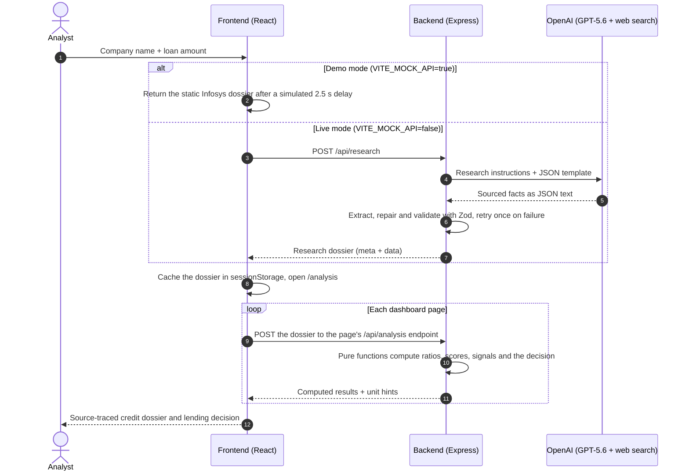

<div align="center">


# Finlasys

**Would you lend them ₹1 Crore?**

AI-researched, rule-scored credit analysis for Indian listed companies. Enter a company name and a loan amount, and Finlasys returns a source-traced credit dossier with a lending decision you can defend.


</div>

> [!IMPORTANT]
> **This repository runs on static Infosys data by default.** To avoid unnecessary API costs, the AI research step returns a pre-generated **Infosys Limited** dataset instead of making a live GPT-5.6 call. This static data is used only for demo, development and testing. Every company name you enter returns the Infosys analysis. If you want to evaluate the project with real GPT-5.6 calls, **[contact me](#contact)** and I'll switch my environment from mock data to live API calls. See the [Disclaimer](#disclaimer) for details.

## Table of contents

- [Overview](#overview)
- [Features](#features)
- [How it works](#how-it-works)
- [Tech stack](#tech-stack)
- [Getting started](#getting-started)
- [Configuration](#configuration)
- [Demo walkthrough](#demo-walkthrough)
- [Scoring methodology](#scoring-methodology)
- [API reference](#api-reference)
- [Project structure](#project-structure)
- [Engineering highlights](#engineering-highlights)
- [Known limitations](#known-limitations)
- [Disclaimer](#disclaimer)
- [Contact](#contact)

## Overview

A credit analyst reviewing a borrower has to combine annual reports, exchange filings and data aggregators that often disagree. They then have to turn all of it into a recommendation that a credit committee will accept. Finlasys automates this workflow for Indian listed companies in two separate layers:

1. **Research (AI).** GPT-5.6 with live web search collects the following:
   - five years of consolidated financials and the latest quarterly results
   - business-segment data
   - market and shareholding data
   - the external credit rating, key risks and recent material events

   The model cites a source for every figure. It records each disagreement between sources and each assumption it had to make, and it returns `null` instead of guessing.
2. **Analysis (deterministic code).** A rule-based engine turns the researched facts into ratios, a financial health score, risk and opportunity signals and a data-quality assessment. It also builds a weighted credit scorecard with a risk grade, indicative loan terms and stress scenarios. The result is a final recommendation: **Approve**, **Approve with Conditions** or **Decline**.

The AI is explicitly told not to compute scores, ratios or recommendations. It only finds and cites facts. As a result, every decision is reproducible and auditable, and you can trace it back to the evidence behind it.

## Features

- **A complete credit dossier from two inputs.** Enter an Indian listed company and a loan amount. You get a five-page analysis that covers financial health, risk signals, evidence and the lending decision.
- **AI for research, code for judgment.** Every ratio, score, signal and recommendation comes from fixed, documented rules, so the scoring is transparent and repeatable.
- **Every number traced to a source.** Each figure carries a citation. When sources disagree, the app shows their values side by side, along with the value it selected and the likely reason for the difference. Estimates are recorded as explicit assumptions with a confidence level.
- **Methodology explained in the UI.** The app shows score breakdowns, a *"How is this score calculated?"* explainer and methodology notes next to the numbers.
- **Stress testing.** Scenario analysis scores the borrower again under revenue falls and rises of 20%.
- **Clear about missing data.** Missing figures stay `null`, and the Segment View shows an explicit empty state when a company doesn't disclose segments. If a run had no access to live web search, the app flags it.
- **Cost-aware demo mode.** One environment flag replaces the paid AI research call with a static dataset, so you can explore the whole app without spending API credits.

### The dashboard

| Page | What you get |
|---|---|
| **Overview** | Lending recommendation with confidence level, the top 3 signals, six key indicators (revenue, EBITDA, net profit, net debt or net cash, interest coverage, EBITDA margin) with year-over-year changes and sparklines, the Financial Health Score gauge and a 3-year trend table |
| **Financial Health** | Tabs for Profitability, Leverage & Debt, Cash Flow and Working Capital, a 5-year Key Ratios table, and a Segment View with segment cards, a stacked revenue trend, a performance table and a revenue-mix donut |
| **Risk & Opportunity Signals** | Signal counts by severity, an overall risk score, severity filters, and a card for each signal showing its key metrics, its impact on the decision and a small trend chart |
| **Evidence & Sources** | Data coverage, the mix of sources and a data-quality summary. Tabs show the evidence for each metric, the source directory (with reliability ratings and why each source is trusted), discrepancies, assumptions and a data-quality score across 5 dimensions |
| **Lending Decision** | Final recommendation, key decision drivers, an A–D risk grade, a weighted scorecard, indicative terms (limit, tenure, rate, security, covenant tier), scenario analysis, conditions precedent, covenants and next steps |

Changes are colored by whether they're good for a lender, not by sign alone. For example, falling net debt is shown in green. The landing page has quick-pick chips for popular companies, loan presets from ₹25L to ₹5Cr, an amount field that uses Indian digit grouping, and progress messages that change during the research wait.

## How it works

### Request lifecycle



### The research pipeline (live mode)

1. **Validate the request.** Zod checks that `companyName` has at least 2 characters and that `loanAmountInr` is greater than zero.
2. **Build the prompt.** The [system instruction](backend/src/prompts/creditAnalysisPrompt.js) limits the model to collecting data, with these rules:
   - Prefer the company's investor-relations filings and BSE/NSE disclosures, and use aggregators such as screener.in only to corroborate them.
   - Report consolidated ₹ crore figures.
   - Cite at least one source for every fiscal year.
   - Log every discrepancy and assumption.
   - Never compute scores or recommendations.

   The user prompt adds the loan context, which steers how deep the research goes. For example, liquidity and leverage matter more for larger loans. It also includes a JSON template of the exact shape required.
3. **Call the model.** The backend uses the OpenAI Responses API with model `gpt-5.6`, the hosted `web_search` tool, `reasoning.effort: "medium"` and `max_output_tokens: 32768`. Reasoning tokens count against this same token budget.
4. **Fall back if web search fails.** If the web-search request fails, the backend retries once without tools, using an instruction that tells the model it has no live access. The response is then marked `groundedWithLiveSearch: false`, and the UI warns that the figures may be out of date. The data-quality *timeliness* score also drops.
5. **Parse the output.** The backend strips markdown fences, keeps the text from the first `{` to the last `}` and runs `JSON.parse`. If that fails, it tries [`jsonrepair`](backend/src/utils/extractJson.js) to fix minor syntax errors.
6. **Validate the data.** The parsed data is checked against the [Zod research schema](backend/src/schemas/creditAnalysisSchema.js).
7. **Retry on bad output.** If parsing or validation fails, the backend generates a fresh response once (2 attempts in total) before returning a typed error.

### What the AI researches

| Field | Contents |
|---|---|
| `company` | Name, NSE ticker, BSE code, industry, description |
| `annual` | Last 5 fiscal years: revenue, EBITDA, depreciation, interest, net profit, borrowings, cash & current investments, receivables, payables, operating cash flow (CFO), free cash flow (FCF), and the sources cited for each year |
| `latest_quarters` | Quarters reported after the last fiscal year: revenue, interest, net profit |
| `segments` | Revenue by year for each segment, plus the latest segment EBITDA. Only filled in if the annual report discloses segments |
| `market` | Share price, as-of date, market capitalization, P/E |
| `shareholding` | Promoter, FII and DII holdings, and the share of promoter holdings that is pledged |
| `qualitative` | External credit rating, key risks, recent material events |
| `sources_directory` | Every source used, with its type, category, reliability (1–5), verification status, what it provides and why it's trusted |
| `discrepancies` | Conflicting values by source, the selected value and source, the difference %, the likely reason and the severity |
| `assumptions` | What was assumed, why and how, plus its impact, confidence, related metrics and source |
| `data_quality_notes` | Free-text notes on data limitations |

### How the dashboard gets its numbers

- **Saved for the browser session.** The research dossier reaches the dashboard through React Router state and is also saved in `sessionStorage`. Refreshing the page doesn't start a new, paid research run. If you open `/analysis` with nothing saved, the app sends you back to the landing page.
- **One endpoint per page.** Each dashboard page sends the dossier to its own `/api/analysis/*` endpoint. These endpoints don't keep any state. Each one recomputes what it needs from the raw facts, so you can open the pages in any order.
- **Formatting stays in the frontend.** The backend returns raw numbers plus a unit hint (`cr`, `ratio`, `percent`, `days`, …). The frontend only formats them, using Indian digit grouping (₹1,78,650 Cr) and Lakh or Crore labels.

## Tech stack

| Layer | Technologies |
|---|---|
| **Frontend** | React 19, Vite 8, React Router 7, Tailwind CSS 4, Recharts 2, Framer Motion, GSAP, Lucide icons, Axios, react-hot-toast |
| **Backend** | Node.js, Express 5, Zod 4, jsonrepair, dotenv, cors |
| **AI** | OpenAI Responses API through the `openai` SDK v7: GPT-5.6 with the hosted `web_search` tool and medium reasoning effort |
| **Tooling** | nodemon for backend hot reload, Oxlint for frontend linting |

The whole project is plain JavaScript. The backend uses CommonJS and the frontend uses ES modules.

## Getting started

### Prerequisites

- **Node.js 22.12 or newer**, with npm. The `openai` SDK requires Node 22 or newer, and Vite 8 requires 22.12 or newer.
- **Git.**
- **An OpenAI API key, for live mode only.** Demo mode never calls OpenAI, so a placeholder value is enough.

### 1. Clone the repository

```bash
git clone https://github.com/Ayush-Pratap-Tripathi/finlasys.git
cd finlasys
```

### 2. Set up the backend

```bash
cd backend
npm install
```

Create a `backend/.env` file with the following content:

```dotenv
# Port for the Express API (default: 5000)
PORT=5000

# Required for the server to start. Demo mode never calls OpenAI,
# so any placeholder value works. Use a real key only for live mode.
OPENAI_API_KEY=demo-mode-placeholder

# Model used for live research (default: gpt-5.6)
OPENAI_MODEL=gpt-5.6
```

<details>
<summary>Commands to create the file in one line</summary>

```bash
# macOS / Linux / Git Bash
printf "PORT=5000\nOPENAI_API_KEY=demo-mode-placeholder\nOPENAI_MODEL=gpt-5.6\n" > .env
```

```powershell
# Windows PowerShell
"PORT=5000", "OPENAI_API_KEY=demo-mode-placeholder", "OPENAI_MODEL=gpt-5.6" | Out-File -Encoding ascii .env
```

</details>

Start the API with one of these commands:

```bash
npm run dev    # restarts automatically when files change (nodemon)
npm start      # plain Node, no automatic restart
```

The terminal should print `Server running on http://localhost:5000`. To check the server, open `http://localhost:5000/api/health`, which returns `{"status":"ok"}`.

### 3. Set up the frontend

Open a **second terminal** at the repository root and run:

```bash
cd frontend
npm install
cp .env.example .env    # Windows (cmd or PowerShell): copy .env.example .env
npm run dev
```

The example file already turns on demo mode:

```dotenv
VITE_API_BASE_URL=http://localhost:5000/api
VITE_MOCK_API=true
```

### 4. Run your first analysis

1. Open **http://localhost:5173**.
2. Pick a company or type one in, then choose a loan amount.
3. Click **Run Credit Analysis**.

In demo mode, the research step completes after a simulated delay of about 2.5 seconds, and the dashboard opens with the Infosys dossier.

> [!NOTE]
> The backend must be running even in demo mode. Only the AI research call is mocked. The backend's `/api/analysis/*` endpoints still compute every number on the dashboard live.

### Switching to live mode (optional)

> [!WARNING]
> Live mode makes real, billable GPT-5.6 API calls with web search. A research run can take several minutes. In the worst case, if web search fails *and* the output needs a retry, one run can make up to four model calls.

1. Set a real OpenAI API key as `OPENAI_API_KEY` in `backend/.env`. The key needs access to the configured model.
2. Set `VITE_MOCK_API=false` in `frontend/.env`.
3. Restart both servers.

The dashboard is now built from newly researched data for the company you enter. If live web search isn't available, the backend falls back to the model's own knowledge, and the app warns you that the figures may be out of date. If you'd rather see live mode running on my environment than use your own key, [contact me](#contact).

### Available scripts

| Folder | Command | What it does |
|---|---|---|
| `backend` | `npm run dev` | Starts the API with nodemon, which restarts it when files change |
| `backend` | `npm start` | Starts the API with Node |
| `frontend` | `npm run dev` | Starts the Vite dev server on `http://localhost:5173` |
| `frontend` | `npm run build` | Builds the production bundle into `frontend/dist/` |
| `frontend` | `npm run preview` | Serves the production build locally |
| `frontend` | `npm start` | Serves the build on `0.0.0.0:$PORT`, for hosting platforms that set `PORT` |
| `frontend` | `npm run lint` | Lints the source code with Oxlint |

### Troubleshooting

| Symptom | Fix |
|---|---|
| The backend exits with `Missing required environment variable: OPENAI_API_KEY` | Create `backend/.env` as shown above. Any placeholder key works in demo mode. |
| The page is blank and the browser console shows `Missing VITE_API_BASE_URL environment variable` | Create `frontend/.env` from `.env.example`, then restart `npm run dev`. |
| Dashboard cards show *"Couldn't load this analysis"* | The backend isn't running, or `VITE_API_BASE_URL` points to the wrong port. Start the backend and check `http://localhost:5000/api/health`. |
| Changes to `.env` have no effect | Restart the dev server. Vite reads `.env` only when it starts. |
| Port 5000 is already in use (common on macOS, where AirPlay Receiver uses it) | Set a different `PORT` in `backend/.env` and update `VITE_API_BASE_URL` to match. |
| Opening `/analysis` directly sends you back to the landing page | This is expected. The dashboard needs a research result saved in the current browser tab, so run an analysis first. |

### Production build and deployment

- **Frontend.** `npm run build` writes static files to `frontend/dist/`. Vite embeds `VITE_*` variables into the bundle at build time, so set `VITE_API_BASE_URL` and `VITE_MOCK_API` for the target environment **before** you build. Serve the files with `npm start`, which runs Vite preview and handles client-side routes. You can also use any static host that sends `/analysis/*` routes to `index.html`.
- **Backend.** Run `npm start` on a host with Node.js 22.12 or newer. Set `PORT`, `OPENAI_API_KEY` and, optionally, `OPENAI_MODEL` as environment variables. CORS currently allows all origins, so restrict it in [`server.js`](backend/server.js) for a public deployment.

## Configuration

**Backend** (`backend/.env`)

| Variable | Required | Default | Description |
|---|:-:|---|---|
| `PORT` | No | `5000` | Port that the Express API listens on |
| `OPENAI_API_KEY` | **Yes** | – | The server won't start without it. Any placeholder works in demo mode, but live mode needs a real key |
| `OPENAI_MODEL` | No | `gpt-5.6` | OpenAI model used by the research layer |

**Frontend** (`frontend/.env`)

| Variable | Required | Default | Description |
|---|:-:|---|---|
| `VITE_API_BASE_URL` | **Yes** | – | Base URL of the backend, for example `http://localhost:5000/api`. The app throws an error on load if it's missing |
| `VITE_MOCK_API` | No | `true` in `.env.example` | `true` turns on demo mode, where the static Infosys dossier answers the `/research` call. Any other value, or leaving the variable unset, turns on **live mode** |

Git ignores both `.env` files. Vite reads `.env` only when it starts, so restart `npm run dev` after any change.

## Demo walkthrough

In demo mode, the dashboard is built from the bundled Infosys Limited dossier. The dossier contains:

- consolidated financials for FY2022–FY2026 and Q1 FY2027 results
- five business segments
- 15 cited sources
- 3 recorded discrepancies and 7 assumptions

The dossier was generated for a **₹10 Crore** working-capital request, so the dashboard shows ₹10 Crore whatever amount you enter. The analysis engine computes the following results from it:

| Page | Result |
|---|---|
| **Overview** | Recommendation **APPROVE**, with confidence **71% (MEDIUM)**. Financial Health Score **84/100 (STRONG)** |
| **Key indicators (FY2026)** | Revenue ₹1,78,650 Cr · EBITDA ₹41,156 Cr · Net profit ₹29,440 Cr · Net cash ₹35,151 Cr · Interest coverage 98.9x · EBITDA margin 23.0% |
| **Risk & Opportunity Signals** | 3 moderate-risk signals: receivables growing faster than revenue, profit rising while operating cash flow fell, and a falling EBITDA margin. 3 positive signals: very strong interest coverage, double-digit profit growth and a net-cash balance sheet. Overall risk score **41 (MODERATE RISK)** |
| **Financial Health** | 5 segments. Financial Services is both the largest segment and the one with the highest margin |
| **Evidence & Sources** | 15 sources (11 primary, 4 secondary). Data coverage 82%. Data quality **84/100 (GOOD)**. Shareholding figures that disagree between aggregator sites are flagged and explained |
| **Lending Decision** | Weighted scorecard **83.9, which gives Grade A (Low Risk)**. Limit ₹10 Crore, tenure 36 months, indicative rate 9.25% p.a., unsecured, standard covenants. The grade stays A in both ±20% revenue scenarios |

Confidence is MEDIUM rather than HIGH because the research recorded 3 discrepancies and 7 assumptions. This shows that confidence measures the quality of the data, not the strength of the company's finances.

## Scoring methodology

All analysis logic is in [`backend/src/analysis/`](backend/src/analysis/). It's written as pure functions with fixed thresholds that you can inspect, so the same dossier always produces the same result. Ratios use the latest fiscal year, and trend checks also use the year before it.

| Ratio | Formula |
|---|---|
| EBITDA margin | EBITDA ÷ revenue |
| Net profit margin | Net profit ÷ revenue |
| Interest coverage | EBITDA ÷ interest |
| Net debt | Borrowings − cash & current investments. A negative value means the company has net cash |
| Net debt / EBITDA | Net debt ÷ EBITDA |
| Cash conversion | Operating cash flow ÷ EBITDA |
| FCF margin | Free cash flow ÷ revenue |
| Receivable and payable days | Balance ÷ revenue × 365. This uses revenue as an approximation because the research doesn't capture cost of goods sold |
| Net working-capital days | Receivable days − payable days |

<details>
<summary><b>Financial Health Score (0–100)</b></summary>

The score adds up four parts, calculated from the latest fiscal year ([`financialHealthScore.js`](backend/src/analysis/financialHealthScore.js)):

| Component | Points | Scoring |
|---|--:|---|
| Profitability | 35 | EBITDA margin % (capped at 30), plus a 5-point bonus if the margin rose year over year |
| Leverage | 25 | Net debt / EBITDA: net cash (≤ 0) → 25 · < 1x → 22 · < 2x → 17 · < 3x → 12 · < 4x → 7 · ≥ 4x → 2 |
| Interest coverage | 20 | EBITDA / interest: > 6x → 20 · > 4x → 16 · > 2.5x → 12 · > 1.5x → 6 · otherwise 0 |
| Cash conversion | 20 | CFO / EBITDA: > 0.9 → 20 · > 0.7 → 16 · > 0.5 → 10 · > 0.3 → 5 · otherwise 0 |

**≥ 70 → STRONG · 50–69 → MODERATE · < 50 → WEAK.** Missing leverage data scores 20 out of 25. A company with no interest expense gets the full coverage score. A missing margin or cash-conversion figure scores 0.

</details>

<details>
<summary><b>Risk and opportunity signals, and the overall risk score</b></summary>

Eight rule-based detectors compare the latest fiscal year with the year before it ([`financialSignals.js`](backend/src/analysis/financialSignals.js)). A detector produces no signal when data is missing.

| Signal | Fires when | Severity |
|---|---|---|
| Receivables growing faster than revenue | Receivables growth exceeds revenue growth by ≥ 3 pp | Moderate (High at ≥ 15 pp) |
| Debt increasing faster than EBITDA | Borrowings growth exceeds EBITDA growth by ≥ 5 pp (only if there's debt in both years) | Moderate (High at ≥ 20 pp) |
| Profit growing but cash generation declined | Net profit rose while operating cash flow fell | Moderate |
| EBITDA margin compression or improvement | Margin fell or rose by ≥ 0.5 pp | Moderate if it fell, Positive if it rose |
| Thin or very strong interest coverage | Coverage < 2x or > 10x | High if < 2x, Positive if > 10x |
| Double-digit profit growth | Net profit growth ≥ 8% | Positive |
| Net-cash balance sheet, or rising leverage | Net debt / EBITDA ≤ 0, or up ≥ 0.5x on the year before | Positive for net cash. Moderate for rising leverage (High if it reaches ≥ 3x) |
| Working-capital needs rising | Net working-capital days up by ≥ 5 | Moderate (High at ≥ 15 days) |

**Overall risk score:** 35 + 18 for each high-risk signal + 9 for each moderate signal − 7 for each positive signal, kept within 0–100. **≥ 65 → HIGH RISK · 35–64 → MODERATE RISK · < 35 → LOW RISK.** This score is kept separate from the health score on purpose. It measures how much is flagged right now, not how strong the balance sheet is.

</details>

<details>
<summary><b>Lending recommendation and confidence</b></summary>

The recommendation logic is in [`lendingRecommendation.js`](backend/src/analysis/lendingRecommendation.js).

| Decision | Rule |
|---|---|
| **Approve** | Health score ≥ 70 **and** no high-risk signal |
| **Approve with Conditions** | Doesn't qualify for Approve, but the health score is ≥ 50 |
| **Decline** | Health score < 50 |

**Confidence** measures data quality, not financial strength: `clamp(94 - 3 * discrepancies - 2 * assumptions, 45, 96)`. A result ≥ 75 is HIGH, 55–74 is MEDIUM and < 55 is LOW. The more conflicts and estimates the research needed, the less certain the underlying figures are.

</details>

<details>
<summary><b>Credit scorecard, risk grade and indicative terms</b></summary>

The scorecard logic is in [`lendingDecisionAnalysis.js`](backend/src/analysis/lendingDecisionAnalysis.js).

| Category | Weight | Basis |
|---|--:|---|
| Financial Health | 30% | The Financial Health Score |
| Credit Risk | 25% | The average of a leverage score (net cash → 100, down to ≥ 4x → 12) and a coverage score (> 8x → 100, down to ≤ 1.5x → 12) |
| Business Outlook | 20% | Revenue CAGR over the researched years (> 15% → 90, down to ≤ 0% → 28). This is based on the financial trend only, not an industry outlook |
| Cash Flow & Liquidity | 15% | CFO / EBITDA (> 0.9 → 95, down to ≤ 0.3 → 18) |
| Management & Governance | 10% | Starts at a neutral 65. Adds 15 if an external credit rating is on record and subtracts 15 for each high-severity discrepancy |

**Risk grade** from the weighted total: **A** ≥ 80 (Low Risk) · **B** ≥ 65 (Moderate Risk) · **C** ≥ 50 (High Risk) · **D** < 50 (Very High Risk).

**Indicative terms** come from a simple, illustrative rate card. They don't reflect any real lender's pricing.

| Grade | Tenure | Indicative rate (8.5% base + premium) |
|---|---|---|
| A | 36 months | 9.25% |
| B | 24 months | 10.25% |
| C | 12 months | 11.50% |
| D | 6 months | 13.00% |

- **Limit:** the requested amount, or ₹0 if the decision is Decline.
- **Security and covenant tier:** Unsecured with Standard covenants if the scorecard total is ≥ 75. Otherwise, Secured with Enhanced covenants.
- **Covenants:** if the Credit Risk score is ≥ 75, total debt / EBITDA must stay below 2.5x and interest coverage above 3.0x. Otherwise, the limits are 3.5x and 2.0x. Quarterly reporting and notice of material events always apply.
- **Conditions precedent:** the latest audited financials and a board resolution. Grades C and D also require a cash-flow projection.
- **Scenario analysis:** the whole scorecard is recalculated with the latest year's revenue, EBITDA, net profit, CFO, FCF, receivables and payables scaled to 80% and to 120%. Borrowings, cash and interest stay the same. The table shows the resulting grade and how much the score changes.

</details>

<details>
<summary><b>Evidence, coverage and data-quality scoring</b></summary>

These scores ([`evidenceAnalysis.js`](backend/src/analysis/evidenceAnalysis.js)) never use the model's own reported confidence.

- **Quality of each metric:** *High* means at least 2 sources cite it and there's no discrepancy. *Medium* means only one source cites it, or there's a low- or medium-severity discrepancy. *Low* means no source cites it, or there's a high-severity discrepancy.
- **Data coverage:** each of five categories is rated Complete (100), Available (80), Partial (50) or Missing (0), and the ratings are averaged. The categories are financial statements, exchange filings, corporate announcements, market data and other public sources.
- **Data-quality score:** the average of five dimensions.

| Dimension | How it's measured |
|---|---|
| Completeness | % of the 11 core annual fields filled in across all years |
| Accuracy | 100 minus 4, 8 or 16 for each low-, medium- or high-severity discrepancy |
| Consistency | 100 minus 10 for each discrepancy |
| Timeliness | 90 if the run used live web search, or 55 if it fell back to the model's own knowledge |
| Source reliability | Average source rating (1–5), converted to a percentage |

**≥ 75 → GOOD · 55–74 → FAIR · < 55 → NEEDS REVIEW.**

</details>

## API reference

The base URL is `http://localhost:5000/api`. All endpoints accept and return JSON.

| Method | Endpoint | Request body | Response |
|---|---|---|---|
| `GET` | `/health` | – | `{ "status": "ok" }` |
| `POST` | `/research` | `{ companyName, loanAmountInr }` | Research dossier `{ meta, data }` from the AI layer |
| `POST` | `/analysis/overview` | `{ data }` | `healthScore`, `topSignals`, `recommendation`, `keyIndicators`, `financialTrend` |
| `POST` | `/analysis/financial-health` | `{ data }` | `profitability`, `leverage`, `cashFlow`, `workingCapital`, `keyRatios`, `segments` |
| `POST` | `/analysis/risk-signals` | `{ data }` | `allSignals`, `riskScore`, `trendData` |
| `POST` | `/analysis/evidence` | `{ data, meta }` | `coverage`, `sourcesOverview`, `keyMetricsEvidence`, `qualityScore`, `qualityCounts` |
| `POST` | `/analysis/lending-decision` | `{ data, meta }` | `recommendation`, `scorecard`, `decisionSummary`, `conditions`, `covenants`, `nextSteps`, `scenarios` |

For `POST /research`, `companyName` must have at least 2 characters and `loanAmountInr` must be a positive number. A number sent as a string is converted. Every `/analysis/*` endpoint validates `data` again, using the same Zod schema that the AI output is checked against.

```jsonc
// POST /api/research — response (shortened)
{
  "meta": {
    "requestedCompany": "infosys",
    "requestedLoanAmountInr": 100000000,
    "model": "gpt-5.6",
    "groundedWithLiveSearch": true,      // false if the run fell back to the model's own knowledge
    "groundingFallbackReason": null,
    "generatedAt": "2026-08-22T03:47:49.395Z"
  },
  "data": {
    "company": { "name": "Infosys Limited", "nse_ticker": "INFY", "bse_code": "500209" /* … */ },
    "annual": [ { "fiscal_year": "FY2026", "revenue_cr": 178650, "ebitda_cr": 41156 /* …, "sources": [] */ } ],
    "latest_quarters": [], "segments": [], "market": {}, "shareholding": {}, "qualitative": {},
    "sources_directory": [], "discrepancies": [], "assumptions": [], "data_quality_notes": []
  }
}
```

The full data model is defined in [`creditAnalysisSchema.js`](backend/src/schemas/creditAnalysisSchema.js).

**Errors** are returned as `{ "error": "message", "details": { … } }`:

| Status | Meaning |
|---|---|
| `400` | The request body failed validation |
| `422` | The AI response didn't match the research schema, even after a retry |
| `502` | OpenAI failed on both the web-search attempt and the fallback, or the AI response couldn't be parsed as JSON even after a retry |
| `500` | Unexpected server error |

> [!TIP]
> You can try the whole analysis engine without any AI calls by sending it the bundled Infosys dossier. Run this in bash from the repository root while the backend is running:
>
> ```bash
> node -e "const m=require('./frontend/src/mocks/infosysMockResponse.json'); process.stdout.write(JSON.stringify({ data: m.data, meta: m.meta }))" \
>   | curl -s -X POST http://localhost:5000/api/analysis/lending-decision -H "Content-Type: application/json" --data-binary @-
> ```

## Project structure

```text
finlasys/
├── backend/                                # Node.js + Express API
│   ├── server.js                           # Entry point: CORS, JSON parsing, /api/health, routers, error handler
│   ├── routes/
│   │   ├── research.routes.js              # POST /api/research
│   │   └── analysis.routes.js              # POST /api/analysis/* (one route per dashboard page)
│   └── src/
│       ├── config/env.js                   # Loads .env, enforces OPENAI_API_KEY, applies defaults
│       ├── container.js                    # Composition root: provider → services → controllers → routers
│       ├── providers/                      # AIProvider abstraction + OpenAIProvider (web search with fallback)
│       ├── prompts/                        # Grounded / fallback system instructions and the user-prompt builder
│       ├── schemas/                        # Zod research contract + the JSON template shown to the model
│       ├── services/                       # CompanyResearchService (AI orchestration, retry) and AnalysisService
│       ├── analysis/                       # Deterministic financial logic - pure functions, no AI
│       │   ├── financialRatios.js          # Single definition of every ratio formula
│       │   ├── financialHealthScore.js     # 0-100 Financial Health Score
│       │   ├── financialSignals.js         # 8 signal detectors + overall risk score
│       │   ├── lendingRecommendation.js    # Approve / Approve with Conditions / Decline + confidence
│       │   ├── lendingDecisionAnalysis.js  # Scorecard, risk grade, terms, covenants, scenarios
│       │   ├── overviewCards.js            # Key indicators + 3-year trend summary
│       │   ├── financialHealthCards.js     # Profitability, leverage, cash-flow, working-capital, key-ratio tabs
│       │   ├── segmentAnalysis.js          # Segment shares, margins, growth and chart data
│       │   └── evidenceAnalysis.js         # Coverage, source stats, metric quality, data-quality score
│       ├── controllers/                    # Thin HTTP adapters: validate → call service → respond
│       ├── validators/                     # Zod request validators
│       ├── errors/AppError.js              # Typed errors carrying HTTP status codes
│       ├── middleware/errorHandler.js      # Turns errors into JSON responses
│       └── utils/extractJson.js            # Pulls JSON out of LLM text, with a jsonrepair fallback
└── frontend/                               # React 19 + Vite 8 single-page app
    ├── .env.example                        # VITE_API_BASE_URL, VITE_MOCK_API
    ├── index.html
    ├── vite.config.js                      # React + Tailwind CSS v4 plugins
    └── src/
        ├── App.jsx                         # Routes: / (landing) and /analysis/* (dashboard)
        ├── pages/                          # Landing page, dashboard layout and the 5 dashboard pages
        ├── components/
        │   ├── landing/                    # Hero, request form, company picker, loan input, pipeline, methodology
        │   ├── dashboard/                  # Sidebar, top bar and the cards / tabs / charts of each page
        │   ├── layout/                     # Navbar and footer
        │   └── ui/                         # Shared primitives: Button, Card, Badge, gauges, charts, sparklines
        ├── hooks/                          # useCompanyResearch, usePageAnalysis, useCountUp
        ├── lib/                            # API client, mock adapter, API wrappers, formatters, constants
        └── mocks/
            └── infosysMockResponse.json    # Static Infosys research dossier used in demo mode
```

## Engineering highlights

- **Swappable AI provider.** The services depend on an abstract [`AIProvider`](backend/src/providers/AIProvider.js), and [`container.js`](backend/src/container.js) is the only place where concrete classes are created. To use a different model provider, you implement one method, `generateGroundedJSON()`, and change one line in `container.js`.
- **Defensive handling of LLM output.** The backend strips markdown fences, repairs minor JSON errors with `jsonrepair`, validates the result with Zod and retries once. Typed errors map to HTTP status codes. See [`extractJson.js`](backend/src/utils/extractJson.js) and [`CompanyResearchService.js`](backend/src/services/CompanyResearchService.js).
- **Fallback when web search fails.** [`OpenAIProvider.js`](backend/src/providers/OpenAIProvider.js) retries without tools, using an instruction that stops the model from presenting its figures as current. The run is flagged in `meta` and in the UI.
- **A deliberate choice not to use Structured Outputs.** OpenAI's JSON-schema mode is not combined with `web_search`. That combination can silently cut off complex JSON partway through instead of raising an error. Prompting for JSON, then validating and retrying, avoids this problem.
- **Quality scores the model can't inflate.** The quality score for each metric and the overall data-quality score come from facts the code can check: source counts, agreement between sources, reliability ratings and whether live search was used. They never use the model's own reported confidence.
- **Independent analysis endpoints.** Each `/api/analysis/*` endpoint recomputes what it needs from the raw dossier. The server keeps no state, and the dashboard pages can load in any order.
- **Analysis separated from presentation.** The API returns raw numbers with unit hints. The frontend only formats them, in [`formatCurrency.js`](frontend/src/lib/formatCurrency.js).
- **Free development loop.** A request interceptor swaps in a custom Axios adapter for the `/research` call only. This lets you test the UI and the real analysis engine without paying for AI calls. See [`apiClient.js`](frontend/src/lib/apiClient.js) and [`mockResearchAdapter.js`](frontend/src/lib/mockResearchAdapter.js).

## Known limitations

- Receivable and payable days are calculated against revenue, because the research doesn't capture cost of goods sold.
- **Business Outlook** is based on revenue growth (CAGR) only, not on an industry or competitive analysis. **Management & Governance** starts at a neutral score and changes only when there's concrete evidence: an external credit rating or high-severity discrepancies.
- The indicative interest rates come from an illustrative rate card (8.5% base plus a premium that depends on the grade). They don't reflect any real lender's pricing.
- In live mode, the quality of the results depends on what the model can find and cite. Check figures against the company's primary filings before relying on them.
- A live research run can take several minutes, and the frontend sets no time limit on the request.
- Demo mode always returns the same Infosys dossier, whatever company or amount you enter.
- The dashboard layout is designed for desktop screens.

## Disclaimer

**Static Infosys data is used for demo, development and testing.**
Each live research run sends a long request to the GPT-5.6 API that uses a lot of reasoning and live web search. A single run takes minutes and costs real money. To avoid unnecessary extra cost, this project runs on a static, pre-generated **Infosys Limited** dataset by default. I use this data only for demoing, developing and testing the project.

- In demo mode, the research step never calls GPT-5.6. The frontend returns [`infosysMockResponse.json`](frontend/src/mocks/infosysMockResponse.json) whatever company or loan amount you enter.
- The analysis engine still runs for real on the backend. This includes the scores, signals, evidence checks and lending decision.
- The Infosys figures are a snapshot from 22 August 2026, according to the dossier's `meta` block. They may not match the company's latest filings.

**Want to test it with real GPT-5.6 calls?** If you'd like to evaluate Finlasys for production use with actual GPT-5.6 API calls, please [contact me](#contact). I'll switch my environment from mock data to live GPT-5.6 research so you can analyze a company of your choice.

**Not financial advice.** Finlasys is a portfolio project. Its scores, risk grades, indicative terms and recommendations come from illustrative rules of thumb and are not investment, lending or credit advice. Company data may be incomplete or out of date, so always check it against the primary filings. This project isn't affiliated with or endorsed by Infosys Limited or OpenAI.

## Contact

**Ayush Pratap** (GitHub: [@Ayush-Pratap-Tripathi](https://github.com/Ayush-Pratap-Tripathi))

If you'd like a live GPT-5.6 demo, or you have questions or feedback, [open an issue](https://github.com/Ayush-Pratap-Tripathi/finlasys/issues/new) in this repository or contact me through my GitHub profile.
